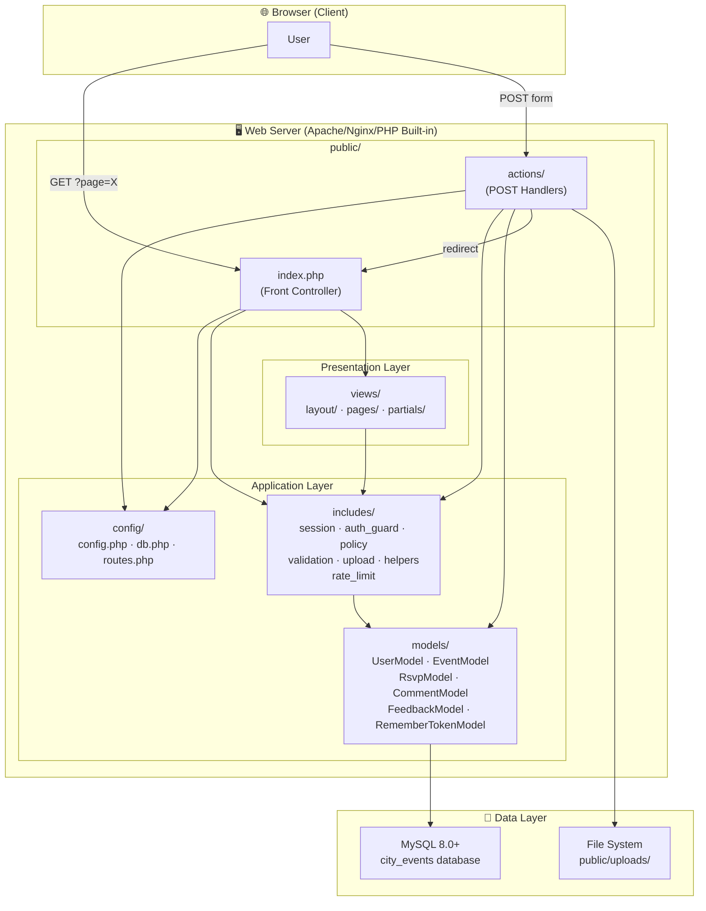
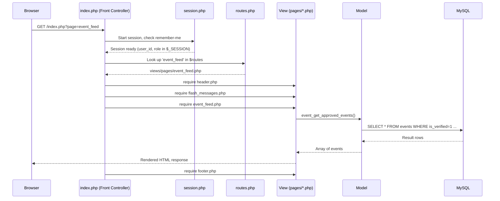
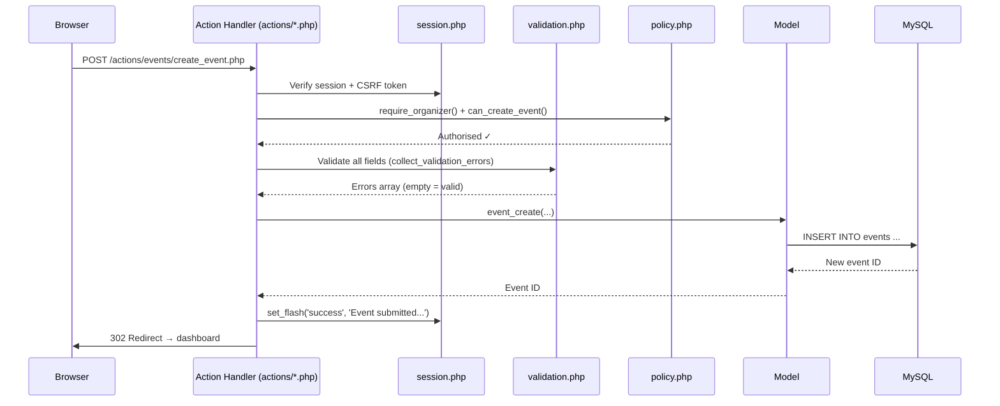
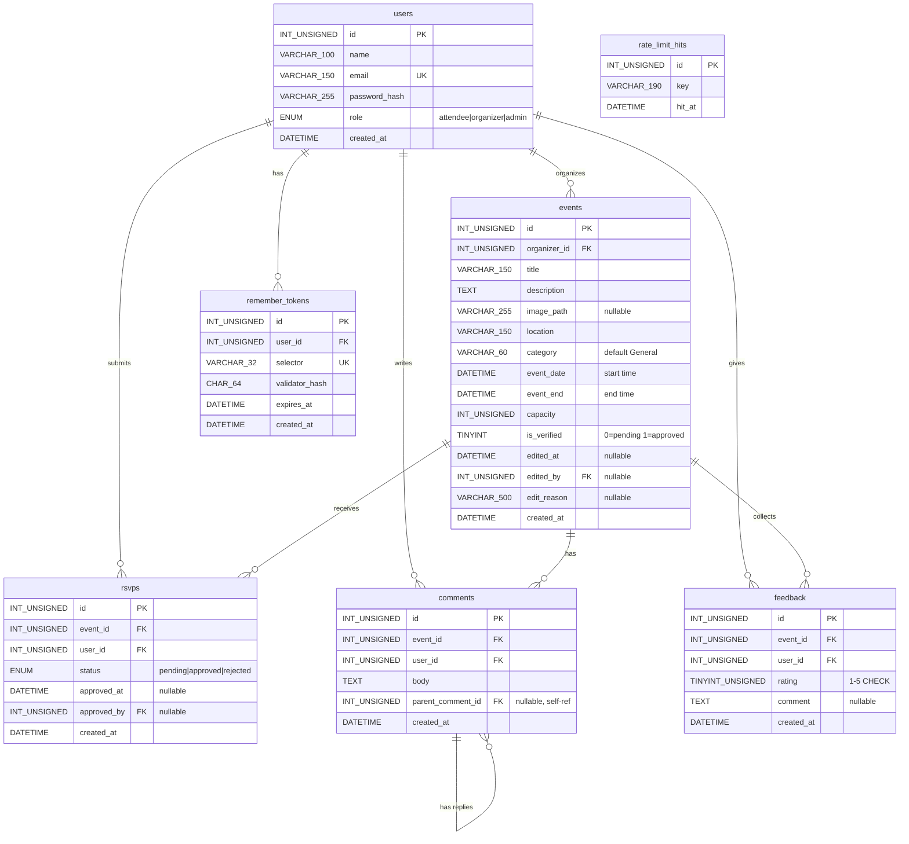

# City-Wide Event Tracking System — Full Architecture Documentation

> **📊 Diagrams not rendering?** Open [PROJECT_DIAGRAMS.html](PROJECT_DIAGRAMS.html) in your browser to see all 17 architecture diagrams fully rendered. VS Code's built-in preview does not support Mermaid — the diagrams render correctly on GitHub and in the HTML file.

> **Part 1 of 3** — Project Overview · Folder Structure · End-to-End Architecture · Database Design
>
> Continue to [Part 2 →](PROJECT_ARCHITECTURE_PART2.md) (Authentication & User Journeys)
> Continue to [Part 3 →](PROJECT_ARCHITECTURE_PART3.md) (Core Logic, Security & Setup)

---

## 1. Project Overview

### 1.1 Purpose

We built the **City-Wide Event Tracking System** as a full-stack web application that allows the city of Hawassa (Sidama Region, Ethiopia) to manage, discover, and track local events. The system serves three distinct user roles — **Attendees**, **Organisers**, and **Administrators** — each with tailored capabilities and views.

### 1.2 Key Features & Scope

| Feature Area | What We Deliver |
|---|---|
| **Event Lifecycle** | Organisers create events → Admin approves → Public visibility → Post-event feedback |
| **RSVP Workflow** | Attendees request RSVP → Organiser approves/rejects → Capacity enforcement with row-level locking |
| **Time-Conflict Detection** | System warns attendees when an RSVP overlaps another event they've registered for |
| **Post-Event Feedback** | Star ratings (1–5) + optional comment, gated to approved attendees after event ends |
| **Comment & Reply System** | Threaded comments — attendees ask questions, organisers reply |
| **Admin Panel** | Event approval queue, user management (CRUD), role changes, view-switching |
| **Role-Based Access Control** | Three roles with policy-based guards on every action |
| **Remember-Me Authentication** | Secure, long-lived login using split-token cookie rotation |
| **Security Hardening** | CSRF protection, rate limiting, login throttling, prepared statements, security headers |

### 1.3 Technology Stack

| Layer | Technology |
|---|---|
| **Language** | PHP 8.1+ (`declare(strict_types=1)` everywhere) |
| **Database** | MySQL 8.0+ with InnoDB, `utf8mb4` charset |
| **DB Access** | PDO with native prepared statements (`EMULATE_PREPARES = false`) |
| **Frontend** | Vanilla HTML5, CSS3 (custom properties, glassmorphism), vanilla JS |
| **Typography** | Google Fonts — Inter + Manrope |
| **Animations** | Lottie Player (for landing page animations) |
| **Server** | Apache/Nginx with PHP built-in server for local dev |
| **Version Control** | Git + GitHub |

---

## 2. Folder Structure Analysis

### 2.1 Full Project Tree

```
Event_Tracking_with_PHP/
│
├── config/                          # Application-wide configuration
│   ├── config.php                   # Constants, env vars, security bootstrap
│   ├── db.php                       # PDO singleton + optional SQL logging
│   └── routes.php                   # Page-name → view-file map
│
├── includes/                        # Shared PHP modules (our "middleware" layer)
│   ├── auth_guard.php               # Route protection functions
│   ├── helpers.php                  # Utility functions (escaping, redirects, flash)
│   ├── policy.php                   # Authorization policy checks
│   ├── rate_limit.php               # IP+user sliding-window rate limiter
│   ├── session.php                  # Session management, CSRF, remember-me
│   ├── upload.php                   # Centralised image upload handler
│   └── validation.php              # Reusable validation library
│
├── models/                          # Data access layer (one file per entity)
│   ├── UserModel.php                # User CRUD, authentication, role mgmt
│   ├── EventModel.php               # Event CRUD, approval, overlap detection
│   ├── RsvpModel.php                # RSVP lifecycle, conflict detection, capacity
│   ├── CommentModel.php             # Comments + threaded replies
│   ├── FeedbackModel.php            # Post-event ratings + summaries
│   └── RememberTokenModel.php       # Persistent login tokens
│
├── public/                          # Web-accessible document root
│   ├── index.php                    # Front controller (single entry point)
│   ├── favicon.svg                  # Browser favicon
│   ├── uploads/                     # User-uploaded event images (gitignored)
│   ├── assets/
│   │   ├── css/style.css            # Full application stylesheet
│   │   ├── js/                      # Client-side JavaScript
│   │   ├── images/                  # Static images and branding
│   │   └── lottie/                  # Lottie animation JSON files
│   └── actions/                     # POST action handlers (form endpoints)
│       ├── auth/
│       │   ├── login.php            # Login + throttling + remember-me
│       │   ├── register.php         # User registration
│       │   ├── logout.php           # Session destruction + cookie cleanup
│       │   └── switch_view_role.php # Admin role-view switching
│       ├── events/
│       │   ├── create_event.php     # New event submission
│       │   ├── update_event.php     # Event editing + re-approval
│       │   ├── delete_event.php     # Event removal (owner/admin)
│       │   ├── toggle_approval.php  # Admin approve/reject events
│       │   ├── rsvp.php             # RSVP submission + conflict check
│       │   ├── approve_rsvp.php     # Organiser approves RSVP
│       │   ├── reject_rsvp.php      # Organiser rejects RSVP
│       │   ├── comment.php          # Comment + reply posting
│       │   └── submit_feedback.php  # Post-event feedback
│       └── admin/
│           ├── add_user.php         # Admin creates user accounts
│           ├── update_user_role.php  # Admin changes user roles
│           └── delete_user.php      # Admin removes user accounts
│
├── views/                           # Presentation layer (PHP templates)
│   ├── layout/
│   │   ├── header.php               # HTML head, nav bar, role-aware menus
│   │   └── footer.php               # Closing tags, footer content
│   ├── pages/
│   │   ├── landing.php              # Public landing page
│   │   ├── home.php                 # Intermediate home page
│   │   ├── login.php                # Unified login page
│   │   ├── login_attendee.php       # Role-specific login (attendee)
│   │   ├── login_organizer.php      # Role-specific login (organizer)
│   │   ├── login_admin.php          # Role-specific login (admin)
│   │   ├── register.php             # Registration form
│   │   ├── event_feed.php           # Public event listing (paginated)
│   │   ├── event_detail.php         # Single event view (RSVP, comments, feedback)
│   │   ├── dashboard.php            # Organiser dashboard (create/edit/manage)
│   │   ├── admin_events.php         # Admin event approval queue
│   │   ├── admin_users.php          # Admin user management panel
│   │   └── 404.php                  # Not-found page
│   └── partials/
│       ├── flash_messages.php       # Toast-style notification rendering
│       ├── event_card.php           # Reusable event card component
│       ├── login_role_body.php      # Shared login form body
│       ├── ui_icons.php             # SVG icon library (PHP functions)
│       └── hawassa_svg_icons.php    # Hawassa-themed decorative icons
│
├── sql/                             # Database schema & seed data
│   ├── schema.sql                   # Base schema (users, events, rsvps, comments, remember_tokens)
│   ├── seed.sql                     # Sample data (Hawassa events, users)
│   ├── hawassa_rotaract_events.sql  # Additional seed events
│   └── migrations/                  # Incremental schema changes
│       ├── 20260330_01_create_remember_tokens.sql
│       ├── 20260330_02_add_event_edit_audit_and_reapproval.sql
│       ├── 20260331_03_rsvp_approval_events_enddate_feedback.sql
│       ├── 20260331_04_fix_seed_data.sql
│       └── 20260401_05_add_category_to_events.sql
│
├── scripts/                         # CLI maintenance scripts
│   ├── setup_admin_user.php         # Create admin account from CLI
│   ├── setup_organizer_user.php     # Create organizer account from CLI
│   ├── reset_admin_password.php     # Reset admin password from CLI
│   └── import_channel_announcements.php  # Bulk event import tool
│
├── docs/                            # Project documentation
│   ├── course-alignment.md          # How project maps to course syllabus
│   ├── implementation-status.md     # Feature completion tracker
│   ├── testing_checklist.md         # QA checklist
│   ├── roadmap.md                   # Future feature roadmap
│   └── ...                          # Various dev notes
│
├── README.md                        # Project introduction
├── CONTRIBUTING.md                  # Contribution guidelines
├── .gitignore                       # Git ignore rules
└── fix_seed.php                     # One-time seed data repair script
```

### 2.2 Why This Structure?

Our architecture follows the **Model-View-Action (MVA)** pattern, a practical variant of MVC optimised for pure PHP projects without a framework router:

- **`config/`** — Centralised configuration keeps database credentials, constants, and route definitions in one place. Environment variables override defaults for deployment flexibility.
- **`includes/`** — Our "middleware" layer. Every shared concern (auth, validation, security) lives here as reusable function libraries. This avoids code duplication across action handlers.
- **`models/`** — Pure data-access functions. Each model file corresponds to a database table and encapsulates all SQL queries for that entity. No business logic leaks into views.
- **`public/`** — The only directory exposed to the web server. The front controller (`index.php`) is the single entry point for all page requests; `actions/` handles form POSTs separately.
- **`views/`** — Presentation only. Templates receive data and render HTML; they never execute database queries directly. The `layout/` + `partials/` sub-structure enables reuse.
- **`sql/`** — Database schema versioned alongside code. Migrations are numbered chronologically and designed to be idempotent (safe to re-run).

---

## 3. End-to-End Architecture & Flow

### 3.1 High-Level System Architecture



### 3.2 Request Lifecycle — Page View (GET)



### 3.3 Request Lifecycle — Form Action (POST)



### 3.4 How Frontend and Backend Interact

Our application follows the **traditional server-rendered pattern** (no SPA/API):

1. **Page navigation** — Every page is a GET request to `index.php?page=<name>`. The front controller maps the page name to a view file via `routes.php`.
2. **Form submissions** — Every form POSTs to a dedicated action handler in `public/actions/`. The handler validates, executes business logic, sets a flash message, and redirects back (PRG pattern — Post/Redirect/Get).
3. **State transfer** — Session variables (`$_SESSION`) carry flash messages, validation errors, and old form input across the redirect boundary. This gives users immediate feedback without JavaScript.
4. **No AJAX** — All interactions are full page loads. This keeps the architecture simple and aligns with the pure-PHP educational scope.

---

## 4. Database Design

### 4.1 Entity-Relationship Diagram



### 4.2 Table Details

#### `users`
| Column | Type | Constraints | Purpose |
|---|---|---|---|
| `id` | `INT UNSIGNED` | PK, AUTO_INCREMENT | Unique user identifier |
| `name` | `VARCHAR(100)` | NOT NULL | Display name |
| `email` | `VARCHAR(150)` | NOT NULL, UNIQUE | Login credential, case-insensitive |
| `password_hash` | `VARCHAR(255)` | NOT NULL | bcrypt hash via `password_hash()` |
| `role` | `ENUM('attendee','organizer','admin')` | NOT NULL, DEFAULT 'attendee' | Access control role |
| `created_at` | `DATETIME` | NOT NULL, DEFAULT CURRENT_TIMESTAMP | Registration timestamp |

#### `events`
| Column | Type | Constraints | Purpose |
|---|---|---|---|
| `id` | `INT UNSIGNED` | PK, AUTO_INCREMENT | Unique event identifier |
| `organizer_id` | `INT UNSIGNED` | FK → users(id), CASCADE | Event creator |
| `title` | `VARCHAR(150)` | NOT NULL | Event title (max 150 chars) |
| `description` | `TEXT` | NOT NULL | Full event description (max 5000 chars enforced in PHP) |
| `image_path` | `VARCHAR(255)` | NULL | Relative path to uploaded image |
| `location` | `VARCHAR(150)` | NOT NULL | Physical venue/address |
| `category` | `VARCHAR(60)` | NULL, DEFAULT NULL | Event category (e.g., "Music", "Tech") |
| `event_date` | `DATETIME` | NOT NULL | Start date/time |
| `event_end` | `DATETIME` | NULL | End date/time |
| `capacity` | `INT UNSIGNED` | NOT NULL | Maximum approved attendees |
| `is_verified` | `TINYINT(1)` | NOT NULL, DEFAULT 0 | Admin approval status |
| `edited_at` | `DATETIME` | NULL | Last edit timestamp |
| `edited_by` | `INT UNSIGNED` | FK → users(id), SET NULL | Who edited last |
| `edit_reason` | `VARCHAR(500)` | NULL | Reason for edit (audit trail) |
| `created_at` | `DATETIME` | NOT NULL, DEFAULT CURRENT_TIMESTAMP | Creation timestamp |

#### `rsvps`
| Column | Type | Constraints | Purpose |
|---|---|---|---|
| `id` | `INT UNSIGNED` | PK, AUTO_INCREMENT | Unique RSVP identifier |
| `event_id` | `INT UNSIGNED` | FK → events(id), CASCADE | Target event |
| `user_id` | `INT UNSIGNED` | FK → users(id), CASCADE | Requesting user |
| `status` | `ENUM('pending','approved','rejected')` | NOT NULL, DEFAULT 'pending' | Approval state |
| `approved_at` | `DATETIME` | NULL | When approved/rejected |
| `approved_by` | `INT UNSIGNED` | FK → users(id), SET NULL | Who approved |
| `created_at` | `DATETIME` | NOT NULL, DEFAULT CURRENT_TIMESTAMP | Request timestamp |

**Unique constraint**: `(event_id, user_id)` — one RSVP per user per event.

#### `comments`
| Column | Type | Constraints | Purpose |
|---|---|---|---|
| `id` | `INT UNSIGNED` | PK, AUTO_INCREMENT | Unique comment ID |
| `event_id` | `INT UNSIGNED` | FK → events(id), CASCADE | Associated event |
| `user_id` | `INT UNSIGNED` | FK → users(id), CASCADE | Comment author |
| `body` | `TEXT` | NOT NULL | Comment content (max 1000 chars in PHP) |
| `parent_comment_id` | `INT UNSIGNED` | FK → comments(id), CASCADE, NULL | Self-referencing for replies |
| `created_at` | `DATETIME` | NOT NULL, DEFAULT CURRENT_TIMESTAMP | Posted timestamp |

#### `feedback`
| Column | Type | Constraints | Purpose |
|---|---|---|---|
| `id` | `INT UNSIGNED` | PK, AUTO_INCREMENT | Unique feedback ID |
| `event_id` | `INT UNSIGNED` | FK → events(id), CASCADE | Rated event |
| `user_id` | `INT UNSIGNED` | FK → users(id), CASCADE | Reviewer |
| `rating` | `TINYINT UNSIGNED` | NOT NULL, CHECK (1–5) | Star rating |
| `comment` | `TEXT` | NULL | Optional written feedback |
| `created_at` | `DATETIME` | NOT NULL, DEFAULT CURRENT_TIMESTAMP | Submission timestamp |

**Unique constraint**: `(event_id, user_id)` — one feedback per user per event.

#### `remember_tokens`
| Column | Type | Constraints | Purpose |
|---|---|---|---|
| `id` | `INT UNSIGNED` | PK, AUTO_INCREMENT | Token record ID |
| `user_id` | `INT UNSIGNED` | FK → users(id), CASCADE | Token owner |
| `selector` | `VARCHAR(32)` | NOT NULL, UNIQUE | Public lookup key (16 random bytes, hex) |
| `validator_hash` | `CHAR(64)` | NOT NULL | SHA-256 hash of secret validator |
| `expires_at` | `DATETIME` | NOT NULL | Token expiry (30 days) |
| `created_at` | `DATETIME` | NOT NULL, DEFAULT CURRENT_TIMESTAMP | Issued timestamp |

#### `rate_limit_hits`
| Column | Type | Constraints | Purpose |
|---|---|---|---|
| `id` | `INT UNSIGNED` | PK, AUTO_INCREMENT | Hit record ID |
| `key` | `VARCHAR(190)` | NOT NULL | Composite key: `action|IP|user_id` |
| `hit_at` | `DATETIME` | NOT NULL, DEFAULT CURRENT_TIMESTAMP | When the hit occurred |

### 4.3 Database Connection

In our `config/db.php`, we use a **singleton pattern** via a static variable in `get_pdo()`:

```php
function get_pdo(): PDO {
    static $pdo = null;
    if ($pdo instanceof PDO) return $pdo;

    $dsn = 'mysql:host=' . DB_HOST . ';dbname=' . DB_NAME . ';charset=utf8mb4;connect_timeout=5';
    $pdo = new PDO($dsn, DB_USER, DB_PASS, [
        PDO::ATTR_ERRMODE            => PDO::ERRMODE_EXCEPTION,
        PDO::ATTR_DEFAULT_FETCH_MODE => PDO::FETCH_ASSOC,
        PDO::ATTR_EMULATE_PREPARES   => false,   // Real prepared statements
        PDO::ATTR_TIMEOUT            => 5,
    ]);
    return $pdo;
}
```

**Key decisions:**
- `EMULATE_PREPARES = false` — Forces MySQL to use **native prepared statements** for genuine SQL injection protection.
- `ERRMODE_EXCEPTION` — Every SQL error throws a `PDOException`, making failures impossible to silently ignore.
- `FETCH_ASSOC` — All results return as associative arrays for clean, predictable access.
- `utf8mb4` — Full Unicode support, including emoji.
- Optional `LoggedPDOStatement` subclass wraps `execute()` to log slow queries (controlled by `ENABLE_SQL_QUERY_LOGGING`).

### 4.4 Query Patterns

Throughout the project we follow these patterns:

1. **Always prepared statements** — No raw string concatenation in SQL:
   ```php
   $stmt = $pdo->prepare('SELECT * FROM users WHERE email = ? LIMIT 1');
   $stmt->execute([$email]);
   ```

2. **Named parameters** for complex queries:
   ```php
   $stmt = $pdo->prepare('INSERT INTO events (...) VALUES (:org, :title, ...)');
   $stmt->execute([':org' => $organizerId, ':title' => $title]);
   ```

3. **Transactions with row locking** for capacity-critical operations:
   ```php
   $pdo->beginTransaction();
   $stmt = $pdo->prepare('SELECT ... FOR UPDATE');  // Row lock
   // ... check capacity, update ...
   $pdo->commit();
   ```

4. **Idempotent migrations** — All ALTER TABLE statements use `IF NOT EXISTS` guards.

### 4.5 Migration Strategy

We version our schema changes in `sql/migrations/` with date-prefixed filenames. Each migration is designed to be re-runnable safely. The chronological order is:

1. `20260330_01` — `remember_tokens` table
2. `20260330_02` — Event edit audit columns (`edited_at`, `edited_by`, `edit_reason`)
3. `20260331_03` — RSVP approval workflow (`status`, `approved_at`, `approved_by`), `event_end`, `feedback` table, `rate_limit_hits` table
4. `20260331_04` — Seed data fixes
5. `20260401_05` — `category` column on events

---

> **Continue to [Part 2 →](PROJECT_ARCHITECTURE_PART2.md)** for Authentication System, User Journeys with diagrams, and the RSVP approval workflow.
