# City-Wide Event Tracking System — Architecture Documentation (Part 2)

> **📊 Diagrams not rendering?** Open [PROJECT_DIAGRAMS.html](PROJECT_DIAGRAMS.html) in your browser to see all 17 architecture diagrams fully rendered. VS Code's built-in preview does not support Mermaid — the diagrams render correctly on GitHub and in the HTML file.

> **Part 2 of 3** — Authentication System · User Journeys with Diagrams
>
> ← [Back to Part 1](PROJECT_ARCHITECTURE_FULL_DOCUMENTATION.md) (Overview, Folder Structure, Architecture, Database)
> → [Continue to Part 3](PROJECT_ARCHITECTURE_PART3.md) (Core Logic, Security, Setup)

---

## 5. Authentication System (Technical Details)

### 5.1 Full Authentication Flow Overview

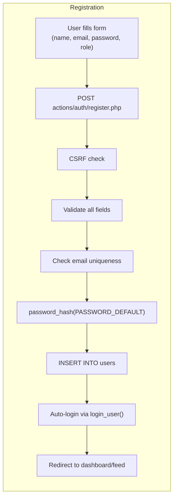

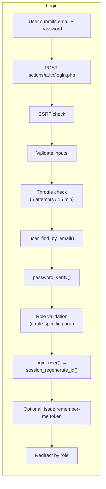

### 5.2 Registration Flow — Step by Step

**Entry**: `POST` to `public/actions/auth/register.php`

1. **Method guard** — Only POST is accepted; GET requests redirect to the form.
2. **CSRF verification** — `verify_csrf_token($_POST['csrf_token'])` compares the submitted token against `$_SESSION['csrf_token']` using `hash_equals()` (timing-safe).
3. **Input extraction** — `request_string()` trims whitespace; email is lowercased.
4. **Validation pipeline** — Runs sequentially; first failure stops and redirects:
   - `validate_required($name)` — Name must not be empty
   - `validate_email($email)` — Must pass `filter_var(FILTER_VALIDATE_EMAIL)`
   - `validate_password_strength($password, 8, true)` — Min 8 chars, at least 1 letter + 1 digit
   - `validate_password_confirmation($password, $confirm)` — Must match (using `hash_equals`)
5. **Role restriction** — Only `'attendee'` or `'organizer'` accepted from the form; admins can only be created via CLI scripts or the admin panel.
6. **Duplicate check** — `user_find_by_email()` queries the database before inserting.
7. **Password hashing** — `password_hash($password, PASSWORD_DEFAULT)` — PHP selects the best available algorithm (bcrypt currently, auto-upgrades in future PHP versions).
8. **Database insert** — `user_create()` inserts with named parameters.
9. **Auto-login** — `login_user()` is called immediately, so the user doesn't need to log in again.
10. **Old input preservation** — On any failure, `set_old_input()` stores name, email, and role (never the password) for form re-population after redirect.

### 5.3 Login Flow — Step by Step

**Entry**: `POST` to `public/actions/auth/login.php`

1. **CSRF check** + **input validation** (email required, password required, valid email format).
2. **Login throttling** (session-based):
   - Key = `SHA-256(lowercase_email | IP_address)` — binds attempts to both email and IP.
   - After **5 failed attempts** within 15 minutes → account is **locked for 15 minutes**.
   - `login_is_locked()` checks `$_SESSION['login_attempts'][$key]['lock_until']`.
   - On success, `clear_login_failures()` resets the counter.
3. **Credential verification**:
   - `user_find_by_email()` fetches the user row.
   - `password_verify($plainPassword, $user['password_hash'])` checks the bcrypt hash.
   - On failure: generic "Invalid credentials" message (never reveals if email exists).
4. **Role-specific login enforcement**:
   - If the form includes a `login_role` field (from role-specific login pages), the user's actual role must match.
   - Mismatch → "You are not authorized to access this panel."
5. **Session creation**:
   - `login_user($user)` calls `session_regenerate_id(true)` to **prevent session fixation**.
   - Stores `user_id` and `user_role` in `$_SESSION`.
6. **Password rehash check** — If `password_needs_rehash()` returns true, we transparently upgrade the hash to the latest algorithm.
7. **Remember-me** (optional):
   - If checkbox is checked, `issue_remember_me_token()` generates a split token.
   - See §5.5 below for full details.
8. **Safe redirect**:
   - Supports `$_POST['redirect']` for returning to the originally requested page.
   - **Open redirect prevention**: Only allows relative paths starting with `/` and not `//`.
   - Default redirects: admin → `admin_events`, organizer → `dashboard`, attendee → `event_feed`.

### 5.4 Logout Flow

**Entry**: `POST` to `public/actions/auth/logout.php`

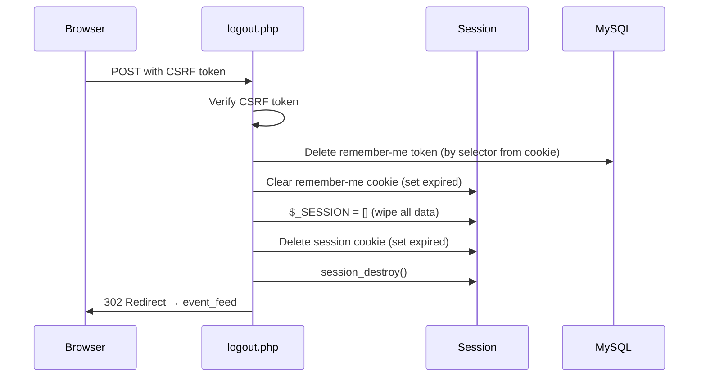

### 5.5 Remember-Me System (Split Token Pattern)

Our remember-me implementation follows the **split-token pattern** recommended by security experts (Paragon Initiative):

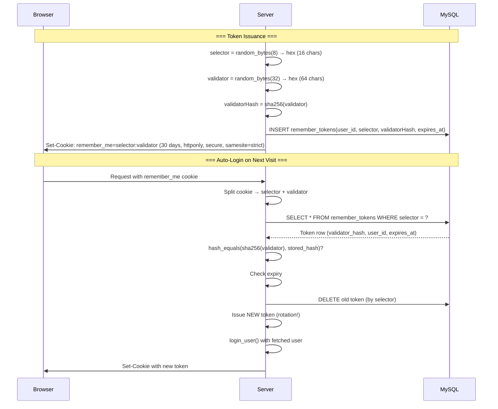

**Why split tokens?**
- The **selector** is a public lookup key (indexed, fast).
- The **validator** is the secret, stored only as a SHA-256 hash in the database.
- Even if the database is compromised, attackers cannot forge cookies — they'd need the unhashed validator.
- **Token rotation** on every use prevents replay attacks and limits the window of a stolen cookie.

### 5.6 Session Security Measures

| Measure | Implementation | Where |
|---|---|---|
| **Session fixation prevention** | `session_regenerate_id(true)` on every login and role change | `session.php` lines 36, 52 |
| **Secure cookie flags** | `httponly=true`, `samesite=Strict`, `secure` when HTTPS | `session.php` line 16–23 |
| **CSRF tokens** | 64-char hex token generated per session, verified on every POST | `session.php` lines 304–323 |
| **Timing-safe comparison** | `hash_equals()` for CSRF and password confirmation | `session.php` line 322, `validation.php` line 132 |
| **Session data wipe on logout** | `$_SESSION = []` + cookie destruction + `session_destroy()` | `session.php` lines 262–274 |
| **Login throttling** | 5 attempts per 15 minutes per email+IP pair | `login.php` lines 11–76 |
| **Role integrity** | Session role always validated against whitelist | `session.php` line 47 |

### 5.7 User Roles & Permissions Matrix

| Action | Attendee | Organizer | Admin |
|---|:---:|:---:|:---:|
| Browse approved events | ✅ | ✅ | ✅ |
| View event detail | ✅ | ✅ | ✅ |
| RSVP to event | ✅ | ✅ | ✅ |
| Submit feedback (post-event) | ✅ | ✅ | ✅ |
| Post comment (post-event) | ✅ | ✅ | ✅ |
| Create event | ❌ | ✅ | ✅ (via view switch) |
| Edit own events | ❌ | ✅ | ✅ |
| Delete own events | ❌ | ✅ | ✅ |
| Approve/reject RSVPs | ❌ | ✅ (own events) | ✅ (all events) |
| Reply to comments | ❌ | ✅ (own events) | ✅ |
| Approve/reject events | ❌ | ❌ | ✅ |
| Manage users (CRUD) | ❌ | ❌ | ✅ |
| Switch role view | ❌ | ❌ | ✅ |
| Create admin accounts | ❌ | ❌ | ✅ |

**Admin View Switching**: Admins can switch their effective role view to `organizer` or `attendee` to see the application exactly as those users would, while remaining authenticated as admin. This is stored in `$_SESSION['admin_view_role']` and affects navigation, dashboard access, and which features are visible — without changing the admin's actual permissions for admin-only operations.

---

## 6. User Journeys (with Graphic Logic)

### 6.1 Journey: Visitor Discovers and Registers

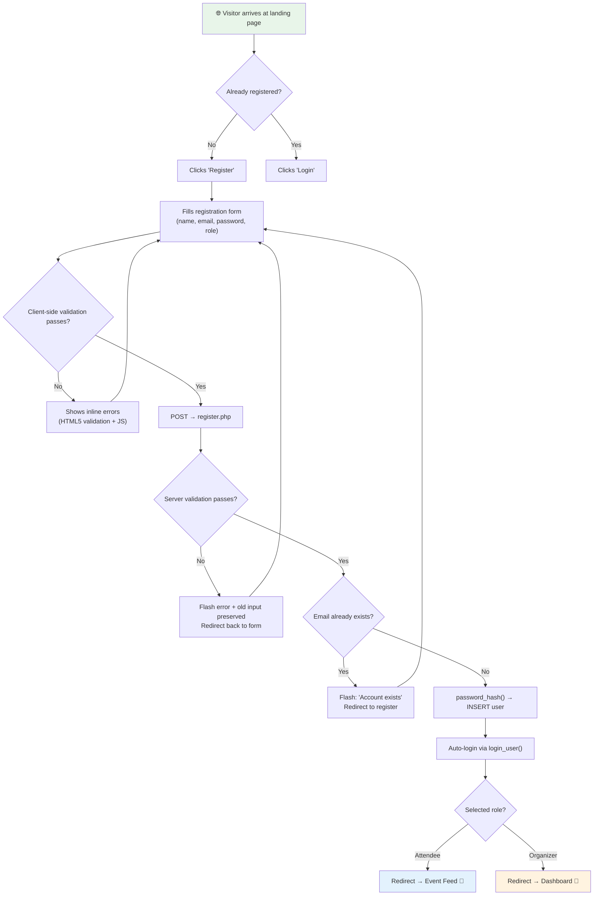

### 6.2 Journey: Attendee RSVPs to an Event

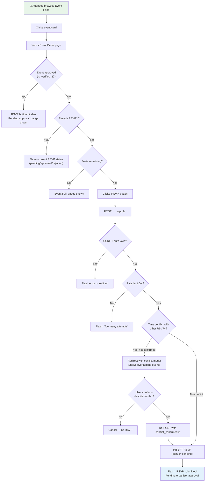

### 6.3 Journey: Organiser Creates and Manages an Event

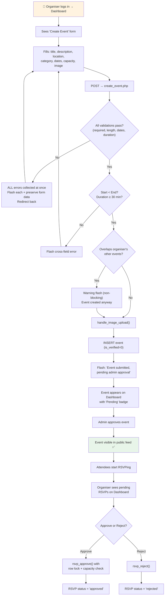

### 6.4 Journey: Admin Manages the Platform

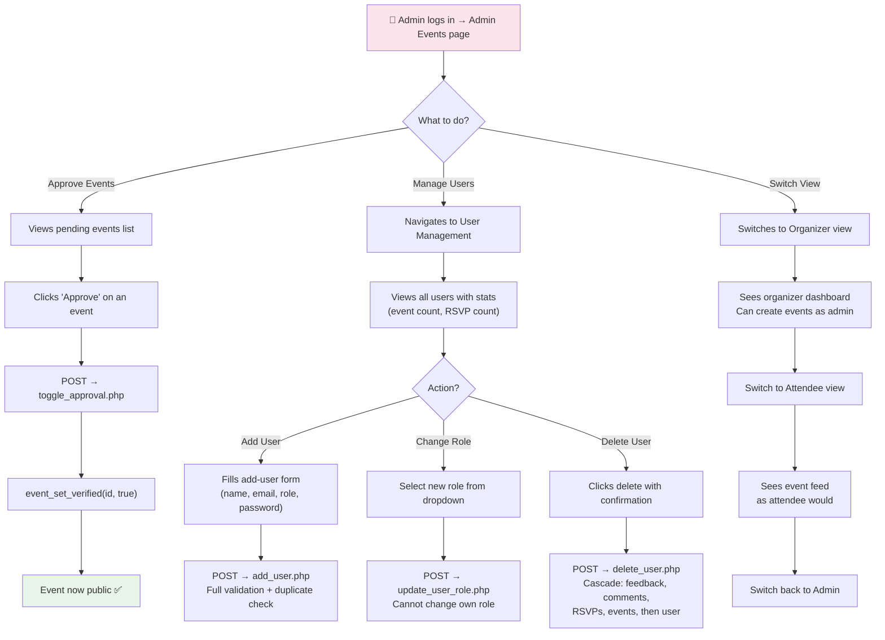

### 6.5 Journey: Post-Event Feedback

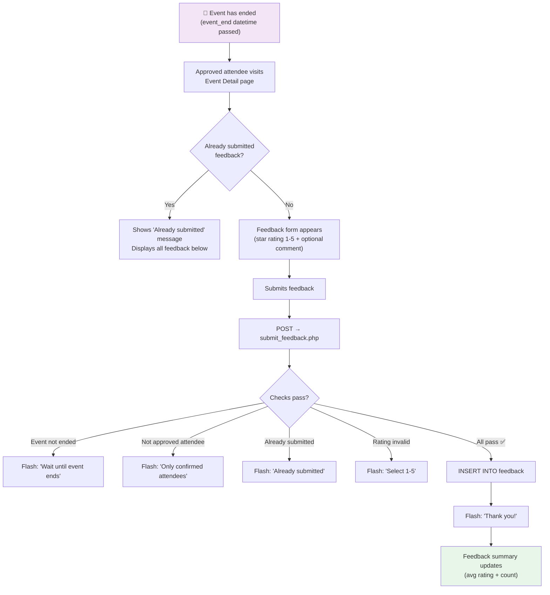

### 6.6 Journey: Comment & Reply System

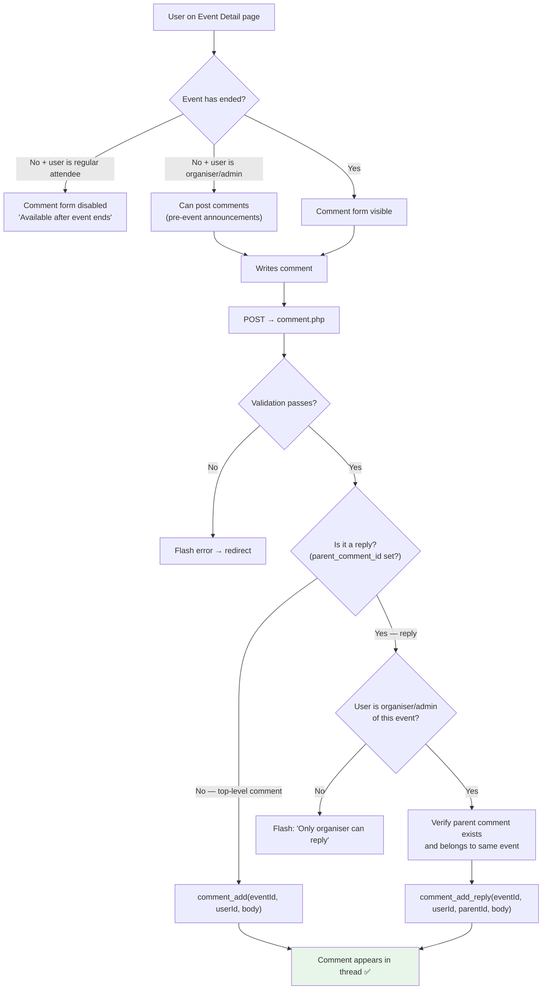

### 6.7 Event Editing & Re-Approval Flow

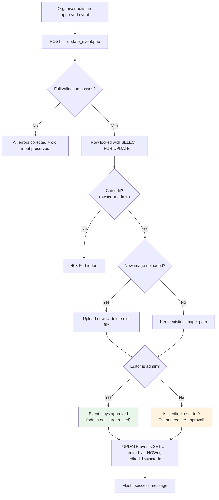

**Key design decision**: When an organiser edits an already-approved event, the event is automatically sent back for admin re-approval. This prevents organizers from getting approval for one event and then changing it to something different. Admin edits bypass this restriction since admins are trusted.

---

> **Continue to [Part 3 →](PROJECT_ARCHITECTURE_PART3.md)** for Core Logic breakdown, Security analysis, Performance considerations, and Setup instructions.
