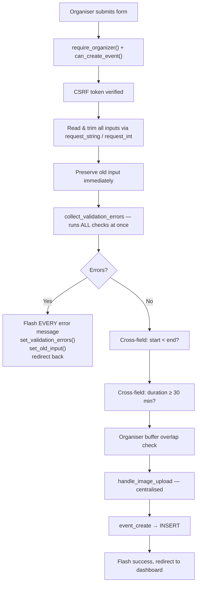
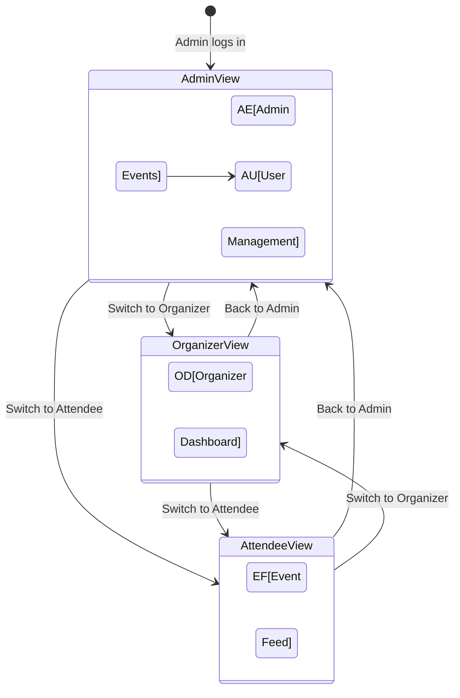

# City-Wide Event Tracking System — Architecture Documentation (Part 3)

> **📊 Diagrams not rendering?** Open [PROJECT_DIAGRAMS.html](PROJECT_DIAGRAMS.html) in your browser to see all 17 architecture diagrams fully rendered. VS Code's built-in preview does not support Mermaid — the diagrams render correctly on GitHub and in the HTML file.

> **Part 3 of 3** — Core Logic & Features · Security & Performance · Setup Guide
>
> ← [Back to Part 1](PROJECT_ARCHITECTURE_FULL_DOCUMENTATION.md) (Overview, Structure, Architecture, Database)
> ← [Back to Part 2](PROJECT_ARCHITECTURE_PART2.md) (Authentication, User Journeys)

---

## 7. Core Logic & Key Features Breakdown

### 7.1 Event Creation — End-to-End

**File**: `public/actions/events/create_event.php`

Our event creation follows a disciplined validation-first pipeline:



**Key design decisions we made:**

1. **All-at-once validation** — We use `collect_validation_errors()` to gather every field error in a single pass. The user sees all problems at once, not one at a time. This is implemented as:
   ```php
   $errors = collect_validation_errors([
       'title'       => validate_required($title, 'Title'),
       'title_len'   => validate_max_length($title, 150, 'Title'),
       'location'    => validate_required($location, 'Location'),
       // ... all fields checked
   ]);
   ```

2. **Form data preservation** — On any validation failure, `set_old_input($oldInput)` stores the submitted data in `$_SESSION['old_input']`. The view retrieves it with `old('title')` using dot-notation access. Passwords are **never** stored in old input.

3. **Minimum event duration** — We enforce a 30-minute minimum (`MIN_EVENT_DURATION_MINUTES`) to prevent nonsensical zero-length events.

4. **Organiser buffer check** — `event_detect_organizer_overlap()` checks if the new event time window (with a 15-minute buffer) overlaps any existing events by the same organiser. This is a **non-blocking warning** — the event is still created, but the organiser is alerted.

5. **Centralised image upload** — `handle_image_upload()` in `includes/upload.php` handles MIME validation (JPEG/PNG/GIF only), 5MB size limit, random filename generation, and directory creation. Returns `string` (path), `null` (no file), or `false` (error with flash already set).

### 7.2 RSVP Approval Workflow

Our RSVP system implements a **three-state approval workflow** with concurrency-safe capacity enforcement:

```
   ┌──────────┐      Organiser      ┌──────────┐
   │ pending  │ ──── approves ────▶ │ approved │
   │          │                      └──────────┘
   │          │      Organiser      ┌──────────┐
   │          │ ──── rejects ─────▶ │ rejected │
   └──────────┘                      └──────────┘
```

**Capacity enforcement with row locking** (`RsvpModel.php` → `rsvp_approve()`):

```php
$pdo->beginTransaction();
// Lock the RSVP row to prevent concurrent approvals
$rStmt = $pdo->prepare(
    'SELECT r.*, e.capacity FROM rsvps r
     JOIN events e ON e.id=r.event_id
     WHERE r.id=? FOR UPDATE'
);
$rStmt->execute([$rsvpId]);
$rsvp = $rStmt->fetch();

// Check capacity INSIDE the transaction
$approved = rsvp_count_approved((int) $rsvp['event_id']);
if ($approved >= (int) $rsvp['capacity']) {
    $pdo->rollBack();
    return false; // Event is full
}

// Safe to approve
$pdo->prepare(
    "UPDATE rsvps SET status='approved', approved_at=NOW(), approved_by=:by WHERE id=:id"
)->execute([':by' => $approverId, ':id' => $rsvpId]);
$pdo->commit();
```

**Why `FOR UPDATE`?** Without it, two concurrent approval requests could both read the same count and both approve, exceeding capacity. The row lock serialises approvals.

### 7.3 Time-Conflict Detection

**File**: `models/RsvpModel.php` → `rsvp_detect_conflicts()`

When a user submits an RSVP, we check whether the target event's time window overlaps with any of their existing pending or approved RSVPs:

```sql
SELECT e.id, e.title, e.event_date, e.event_end
FROM rsvps r
JOIN events e ON e.id = r.event_id
WHERE r.user_id = :uid
  AND r.event_id != :eid
  AND r.status IN ('pending','approved')
  AND e.event_end IS NOT NULL
  AND e.event_date < :end     -- existing starts before new ends
  AND e.event_end  > :start   -- existing ends after new starts
```

If conflicts are found and the user hasn't confirmed, we store the conflict data in `$_SESSION['rsvp_conflicts']` and redirect back with `show_conflict=1` to trigger a confirmation modal in the UI. The user can then re-submit with `conflict_confirmed=1`.

### 7.4 Post-Event Feedback System

**Files**: `models/FeedbackModel.php`, `public/actions/events/submit_feedback.php`

The feedback system is gated by four conditions, each checked in order:

1. **Event must have ended** — `has_datetime_passed($event['event_end'])`
2. **User must be an approved attendee** — `rsvp_user_is_approved_attendee($eventId, $userId)`
3. **One submission per user** — `feedback_has_submitted($eventId, $userId)` enforced by UNIQUE constraint `(event_id, user_id)`
4. **Rating between 1-5** — Server-side integer range check with DB-level `CHECK` constraint

The `feedback_summary()` function returns aggregate data for the event detail page:
```php
SELECT ROUND(AVG(rating), 1) AS avg_rating, COUNT(*) AS cnt
FROM feedback WHERE event_id = :event_id
```

For the organiser dashboard, `feedback_summaries_for_events()` uses `IN (...)` with dynamic placeholders to batch-fetch summaries for all their events in a single query.

### 7.5 Comment & Reply Threading

**File**: `models/CommentModel.php`, `public/actions/events/comment.php`

Our comment system uses a single `comments` table with a self-referencing `parent_comment_id` for one level of nesting:

- **Top-level comments** — `parent_comment_id = NULL`, posted by any logged-in user (attendees only after event ends, organisers/admins anytime)
- **Replies** — `parent_comment_id` points to the parent, restricted to the event organiser or admin

Access control logic:
```php
// Attendees can only comment after event ends
if ($parentId === null && !$eventHasEnded && !$isAdmin && !$isOrganizerOwner) {
    set_flash('error', 'You can submit your feedback only after the event ends.');
    redirect_to_event_or_feed($eventId);
}

// Only organiser/admin can reply
if ($parentId !== null && !$isAdmin && !$isOrganizerOwner) {
    set_flash('error', 'Only the event organizer can reply to comments.');
    redirect_to_event_or_feed($eventId);
}
```

### 7.6 Admin View Switching

**File**: `public/actions/auth/switch_view_role.php`, `includes/session.php`

This feature lets admins experience the app from different role perspectives:



The view role is stored in `$_SESSION['admin_view_role']` and consumed by `current_effective_role()`. Admin-only pages (like user management) still check `user_has_role('admin')` — the actual role, not the effective view role — so admins never lose access to admin functions.

### 7.7 Event Edit with Re-Approval

**File**: `public/actions/events/update_event.php`

When an organiser edits an already-approved event, our system **automatically resets it to pending**:

```php
$resetToPending = !$isAdmin && (int) ($event['is_verified'] ?? 0) === 1;
// ...
$newVerified = $resetToPending ? 0 : (int) ($event['is_verified'] ?? 0);
```

This prevents a "bait-and-switch" where an organiser gets approval and then changes the event to something completely different. Admin edits are trusted and don't trigger re-approval.

The update uses `SELECT ... FOR UPDATE` to lock the event row during the transaction, preventing concurrent edit conflicts. Edit audit fields (`edited_at`, `edited_by`, `edit_reason`) create an accountability trail.

### 7.8 Admin User Management

**Files**: `public/actions/admin/add_user.php`, `update_user_role.php`, `delete_user.php`

| Operation | Safeguards |
|---|---|
| **Add User** | Full validation, duplicate email check (query + UNIQUE constraint race), `password_hash()`, supports all three roles including admin |
| **Change Role** | Whitelist validation (`attendee/organizer/admin`), cannot change own role |
| **Delete User** | Cannot delete self, cascade deletion in transaction: feedback → comments → RSVPs → events → user |

The cascade deletion in `user_delete()` is done manually in PHP (not relying on DB cascades alone) to ensure all related data is cleaned up within a single transaction:

```php
$pdo->beginTransaction();
$pdo->prepare('DELETE FROM feedback WHERE user_id = ?')->execute([$userId]);
$pdo->prepare('DELETE FROM comments WHERE user_id = ?')->execute([$userId]);
$pdo->prepare('DELETE FROM rsvps WHERE user_id = ?')->execute([$userId]);
$pdo->prepare('DELETE FROM events WHERE organizer_id = ?')->execute([$userId]);
$pdo->prepare('DELETE FROM users WHERE id = ?')->execute([$userId]);
$pdo->commit();
```

---

## 8. Security, Performance & Best Practices

### 8.1 Security Measures Summary

| Category | What We Implemented | Where |
|---|---|---|
| **SQL Injection** | Native prepared statements everywhere (`EMULATE_PREPARES = false`) | `config/db.php`, all models |
| **XSS Prevention** | `e()` function wraps `htmlspecialchars(ENT_QUOTES, UTF-8)` for all output | `includes/helpers.php`, all views |
| **CSRF Protection** | 64-char random token per session, verified on every POST with `hash_equals()` | `includes/session.php` |
| **Session Fixation** | `session_regenerate_id(true)` on login and role changes | `includes/session.php` |
| **Session Cookies** | `httponly`, `samesite=Strict`, `secure` (when HTTPS) | `includes/session.php` |
| **Password Storage** | `password_hash(PASSWORD_DEFAULT)` with auto-rehash | `actions/auth/register.php`, `login.php` |
| **Login Throttling** | 5 attempts per 15 min per email+IP, session-based | `actions/auth/login.php` |
| **Rate Limiting** | Sliding window per action/IP/user, DB-backed | `includes/rate_limit.php` |
| **File Upload Security** | MIME-type verification via `finfo`, 5MB limit, random filenames, type whitelist | `includes/upload.php` |
| **Open Redirect Prevention** | Login redirect validates relative-path-only, no scheme/host allowed | `actions/auth/login.php` |
| **Security Headers** | `X-Frame-Options`, `X-Content-Type-Options`, `Referrer-Policy`, `Permissions-Policy`, HSTS | `config/config.php` |
| **HTTPS Enforcement** | Optional `FORCE_HTTPS` redirect for production | `config/config.php` |
| **Timing-Safe Comparisons** | `hash_equals()` for CSRF tokens, password confirmations, remember-me validators | Multiple files |
| **Error Information Hiding** | Generic user-facing errors; detailed `error_log()` server-side | All action handlers |
| **Input Validation** | Centralised library with type-safe returns (`true | string`) | `includes/validation.php` |
| **Role Whitelisting** | All role values validated against `['attendee','organizer','admin']` | `session.php`, `policy.php` |
| **Self-Deletion Prevention** | Admin cannot delete own account or change own role | `admin/delete_user.php`, `update_user_role.php` |
| **Production DB Warning** | Logs a warning if production connects as `root` | `config/db.php` |

### 8.2 Input Sanitisation Deep Dive

Our validation library (`includes/validation.php`) uses a consistent contract:

```php
// Every validate_* function returns:
//   true     → validation passed
//   string   → human-readable error message

$err = validate_required($name, 'Name');
if ($err !== true) {
    set_flash('error', $err);
    redirect('register');
}
```

Available validators:

| Function | Purpose |
|---|---|
| `validate_required()` | Non-empty after trim |
| `validate_max_length()` | String length ceiling (mb_strlen aware) |
| `validate_min_length()` | String length floor |
| `validate_email()` | `filter_var(FILTER_VALIDATE_EMAIL)` |
| `validate_password_strength()` | Min length + letter/digit requirement |
| `validate_password_confirmation()` | Match check with `hash_equals()` |
| `validate_positive_int()` | Must be > 0 |
| `validate_event_datetime_format()` | Parses multiple datetime formats |
| `validate_event_datetime_bounds()` | Must be in future, not too far ahead |
| `validate_file_upload()` | Size, MIME type, upload error checks |
| `collect_validation_errors()` | Aggregate multiple checks into keyed error array |

### 8.3 Performance Considerations

| Area | What We Did |
|---|---|
| **Database connection** | Singleton PDO — one connection per request | 
| **Pagination** | Event feed uses `LIMIT/OFFSET` with `PARAM_INT` binding |
| **Indexing** | Strategic indexes on `rsvps(event_id, status)`, `rsvps(user_id, status)`, `events(organizer_id, event_date, event_end)`, `feedback(event_id)`, `rate_limit_hits(key, hit_at)` |
| **Batch queries** | `feedback_summaries_for_events()` fetches all summaries in one query using `IN(...)` |
| **Lazy model loading** | Models are `require_once`'d only in action handlers that need them — not globally |
| **Slow query logging** | Optional `LoggedPDOStatement` logs queries exceeding `SQL_SLOW_QUERY_MS` threshold |
| **Static assets** | CSS/JS/images served directly by web server, not through PHP |
| **Session overhead** | Minimal session data — only `user_id`, `user_role`, and transient flash/validation data |

### 8.4 Error Handling Strategy

We follow a consistent pattern across all action handlers:

```php
try {
    // Database operation
} catch (PDOException $e) {
    log_exception($e, 'Context: what we were doing');
    set_flash('error', 'Something went wrong. Please try again.');
    redirect('page');
} catch (Throwable $e) {
    log_exception($e, 'Context: unexpected error');
    set_flash('error', 'Something went wrong. Please try again.');
    redirect('page');
}
```

**Principles:**
- Users **never** see stack traces, SQL errors, or internal details.
- `log_exception()` writes full details to `error_log` for debugging.
- Rate limiting **fails open** — if the rate_limit_hits table is unavailable, actions are allowed rather than blocked.

---

## 9. Setup & Running the Project

### 9.1 Prerequisites

| Requirement | Version |
|---|---|
| PHP | 8.1 or higher |
| MySQL | 8.0 or higher |
| Web server | Apache, Nginx, or PHP built-in server |
| PHP extensions | `pdo_mysql`, `fileinfo`, `mbstring` |

### 9.2 Step-by-Step Setup

#### 1. Clone the Repository
```bash
git clone https://github.com/Bini-fish/Event_Tracking_with_PHP.git
cd Event_Tracking_with_PHP
```

#### 2. Create the Database
```bash
mysql -u root -p < sql/schema.sql
```
This creates the `city_events` database and base tables.

#### 3. Run Migrations (in order)
```bash
mysql -u root -p city_events < sql/migrations/20260330_01_create_remember_tokens.sql
mysql -u root -p city_events < sql/migrations/20260330_02_add_event_edit_audit_and_reapproval.sql
mysql -u root -p city_events < sql/migrations/20260331_03_rsvp_approval_events_enddate_feedback.sql
mysql -u root -p city_events < sql/migrations/20260331_04_fix_seed_data.sql
mysql -u root -p city_events < sql/migrations/20260401_05_add_category_to_events.sql
```

#### 4. Load Seed Data (optional, for demo)
```bash
mysql -u root -p city_events < sql/seed.sql
```
This creates sample users (password for all: `password`), events, RSVPs, and comments set in Hawassa city.

**Seed users:**

| Email | Role | Password |
|---|---|---|
| `admin@cityevents.local` | Admin | `password` |
| `dawit@hawassa.et` | Organizer | `password` |
| `sara@hawassa.et` | Organizer | `password` |
| `yonas@hawassa.et` | Organizer | `password` |
| `meron@hawassa.et` | Attendee | `password` |
| `biruk@hawassa.et` | Attendee | `password` |
| `hana@hawassa.et` | Attendee | `password` |
| `abel@hawassa.et` | Attendee | `password` |

#### 5. Configure Database Credentials

Edit `config/config.php` or set environment variables:

```php
// In config/config.php (defaults shown):
DB_HOST = '127.0.0.1'
DB_NAME = 'city_events'
DB_USER = 'root'
DB_PASS = ''
```

Or use environment variables (recommended for deployment):
```bash
export DB_HOST=127.0.0.1
export DB_NAME=city_events
export DB_USER=myuser
export DB_PASS=mypassword
```

#### 6. Set Upload Directory Permissions
```bash
mkdir -p public/uploads
chmod 755 public/uploads
```

#### 7. Start the Development Server
```bash
# Using PHP's built-in server (document root = public/)
php -S localhost:8000 -t public
```

Then visit: **http://localhost:8000**

#### 8. (Optional) Create Admin User via CLI
```bash
php scripts/setup_admin_user.php
```
Follow the interactive prompts to create an admin account.

### 9.3 Environment Variables Reference

| Variable | Default | Purpose |
|---|---|---|
| `DB_HOST` | `127.0.0.1` | MySQL hostname |
| `DB_NAME` | `city_events` | Database name |
| `DB_USER` | `root` | Database username |
| `DB_PASS` | _(empty)_ | Database password |
| `FORCE_HTTPS` | `0` | Redirect HTTP → HTTPS in production |
| `ENABLE_SECURITY_HEADERS` | `1` | Send security HTTP headers |
| `ENABLE_SQL_QUERY_LOGGING` | `0` | Log slow/failed SQL queries |
| `SQL_SLOW_QUERY_MS` | `500` | Threshold for slow query logging (ms) |

### 9.4 Application Constants

| Constant | Value | Purpose |
|---|---|---|
| `APP_NAME` | `'City-Wide Event Tracking System'` | Displayed in page titles |
| `APP_ENV` | `'development'` | Environment mode |
| `MIN_EVENT_DURATION_MINUTES` | `30` | Shortest allowed event |
| `ORGANIZER_BUFFER_MINUTES` | `15` | Gap between organiser's own events |
| `RATE_LIMIT_MAX_LOGIN` | `10` | Max login attempts per window |
| `RATE_LIMIT_MAX_ACTION` | `20` | Max RSVP/comment attempts per window |
| `RATE_LIMIT_WINDOW_SECONDS` | `300` | Rate limit window (5 minutes) |
| `UPLOAD_MAX_IMAGE_BYTES` | `5MB` | Maximum image upload size |
| `REMEMBER_ME_TTL_SECONDS` | `30 days` | Remember-me cookie lifetime |

---

## 10. Quick Reference: File → Responsibility Map

| File | One-Line Purpose |
|---|---|
| `config/config.php` | App constants, env vars, security headers bootstrap |
| `config/db.php` | PDO singleton with optional slow-query logging |
| `config/routes.php` | Maps page names to view file paths |
| `public/index.php` | Front controller — all GET requests enter here |
| `includes/session.php` | Session start, login/logout, CSRF, remember-me |
| `includes/helpers.php` | `e()`, `url_for()`, `redirect()`, flash messages, old input |
| `includes/auth_guard.php` | `require_login()`, `require_admin()`, `require_organizer()` |
| `includes/policy.php` | `can_view_event()`, `can_edit_event()`, `can_rsvp_event()`, etc. |
| `includes/validation.php` | All `validate_*()` functions and `collect_validation_errors()` |
| `includes/upload.php` | `handle_image_upload()` and `delete_uploaded_image()` |
| `includes/rate_limit.php` | Sliding-window rate limiter backed by MySQL |
| `models/UserModel.php` | User CRUD, auth, role stats, cascade delete |
| `models/EventModel.php` | Event CRUD, approval toggle, overlap detection, categories |
| `models/RsvpModel.php` | RSVP add/approve/reject, conflict detection, capacity check |
| `models/CommentModel.php` | Comments and replies CRUD |
| `models/FeedbackModel.php` | Feedback submission, duplicate check, aggregate summaries |
| `models/RememberTokenModel.php` | Remember-me token CRUD and expiry cleanup |

---

## Appendix: How the Validation Contract Works

Our validation functions return `true` on success or a `string` error message on failure. This design lets us use them in two styles:

**Style 1 — Fail-fast (early return):**
```php
$err = validate_required($name, 'Name');
if ($err !== true) {
    set_flash('error', $err);
    redirect('register');
}
```

**Style 2 — Collect all errors:**
```php
$errors = collect_validation_errors([
    'title'    => validate_required($title, 'Title'),
    'location' => validate_required($location, 'Location'),
    'capacity' => validate_positive_int($capacity, 'Capacity'),
]);
if (!empty($errors)) {
    foreach ($errors as $msg) { set_flash('error', $msg); }
    set_validation_errors($errors);  // For field-level highlighting
    set_old_input($oldInput);        // Preserve form data
    redirect('dashboard');
}
```

Registration uses Style 1 (fail on first error), while event creation and editing use Style 2 (show all errors at once).

---

> **End of documentation.** All three parts together provide a complete technical reference for our City-Wide Event Tracking System.
>
> ← [Part 1](PROJECT_ARCHITECTURE_FULL_DOCUMENTATION.md) · [Part 2](PROJECT_ARCHITECTURE_PART2.md) · Part 3 (you are here)
